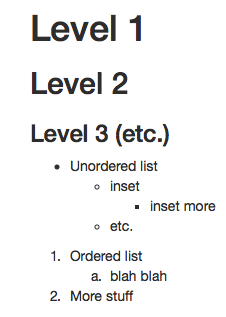
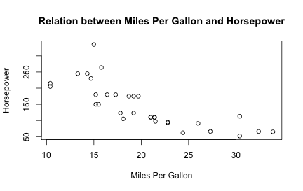
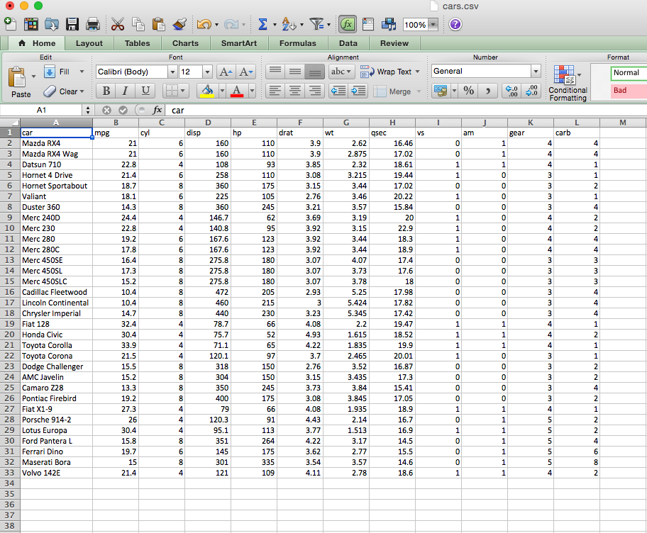
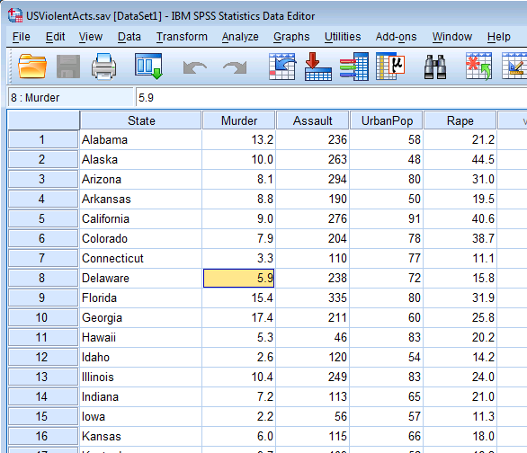
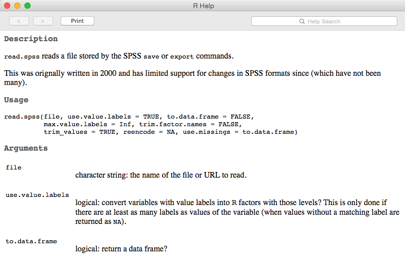
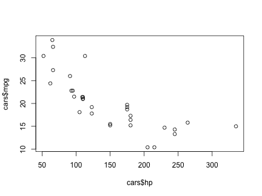
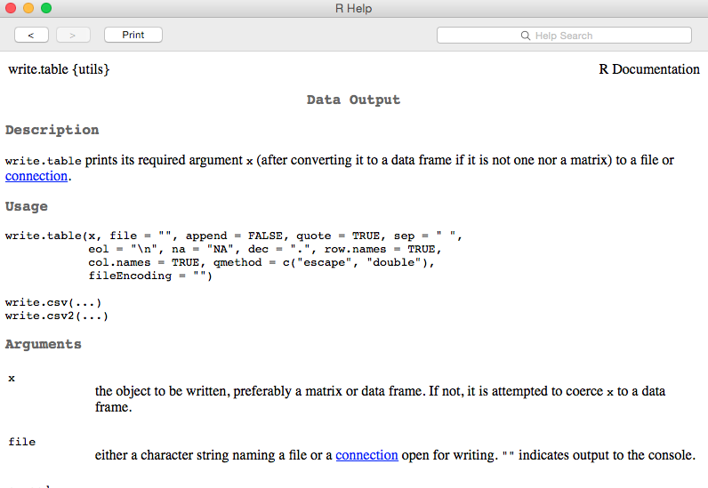

## Welcome back
# Today's agenda
* Introduction to *R Markdown*
* Directory management
* Reading and Writing Data
* Subsetting data frames
* Overview homework
* Lab

--- .segue
# A Brief Intro to R Markdown

<div align = "right">

</div>

---- &twocol
## What is R Markdown

*** =left
* Simple language for convering R code/output into other formats, most notably 
  HTML and PDF
* These slides were produced using a varient of Markdown
* Why is markdown useful?
  - Transparent and reproducible
  - Can (eventually) be more efficient
  - Simple for simple tasks (like homeworks)

*** =right
<div align = "center">

</div>

----
## YAML Front Matter

```
---
title: Example Markdown document
author: Daniel Anderson
date: "2015-09-17"
---
```


* Three dashes before and after the YAML fields
* Case sensitive
* Many other fields are possible.
  + For example, you may want to include an `output:` argument (`pdf_document`,
    `html_document`, `word_document`). Must be specified as it is rendered, if
    not supplied.


---- &twocol
## Headings and Lists

*** =left

```
# Level 1
## Level 2 
### Level 3 (etc.)
```

```
* Unordered list
  - inset
    + inset more
  - etc.

1. Ordered list
  a. blah blah
2. More stuff
```

*** =right



---- &twocol
## Code chunks

Start a code chunk with \`\`\`{r}, then produce some r code, then close the 
  chunk with three additional back ticks \`\`\`.

*** =left


```r
a <- 3
b <- 5

a + b * (exp(a)/b)
```

```
## [1] 23.08554
```

You can show code without evaluating it, using `eval = FALSE`. 


*** =right

Alternatively, you can evaluate the code without displaying it, using `echo = 
  FALSE`.


 

-----
## Inline code

A single back tick followed by `r` prooduces inline code to be evaluated.

<div align = "center">

</div>
<br>

This is an example of inline code, where I want to refer to the sum of `a` and
  `b`, which is 8.


----- &twocol
## Rendering the document

*** =left

Through a text editor (e.g., SublimeText)


```r
install.packages("rmarkdown")
library(rmarkdown)
setwd("dir/to/Rmd/doc")
render("ExampleRMarkdown.Rmd", 
  "html_document")
```

Note that the document type need not be specified if `output:` is supplied in 
  the YAML front matter. 

*** =right

Through RStudio


---- &twocol
## Final Product

*** =left
<div align = "right">

</div>

*** =right
<div align = "left">

</div>

----
## Final remarks on R Markdown

* Make sure to look at the documentation
    + http://RMarkdown.rstudio.com
    + http://RMarkdown.rstudio.com/authoring_basics.html
    + http://RMarkdown.rstudio.com/authoring_rcodechunks.html

* Don't spend too much time fussing around with it
    + It's meant to be an easy way for me to see what you did and give you 
      feedback for homeworks. If you find yourself stuck, look at the 
      documentation, search google, and/or ask me for help

* The more you ask from it, the more complicated it will be. Basic usage is 
  pretty straightforward

---- .segue
# Directory management and reading/writing data

----
## Directory Management

What is a working directory?
  * Exactly what it sounds like--the directory from which R will work
  * Read and write files from and to this directory

Identify current working directory


```r
getwd()
```

```
## [1] "/Users/Daniel/Dropbox/Teaching/CourseR"
```

------ 
## Looking into a working directory

What's in this directory? Two ways to find out:
* Navigate to the directory and take a look.
<div align = "left">

</div>

* Have R look for you


```r
list.files()
```

```
## [1] "data"          "homeworks"     "LICENSE"       "Presentations"
## [5] "Readings"      "README.md"     "Syllabus"      "Weeks"
```
The `list.files()` function shows what R "sees".

------
## Navigating your directory quickly
* Change directory from current location to a nested folder


```r
setwd("./nested/folders")
```
Here the `.` is essentially a fill-in for `getwd()`. 
* Navigate back one folder


```r
setwd("..")
```
* Navigate back two folders


```r
setwd("../..")
```

------
## Reading Data into R
To read data into R, you must tell R where the data are located by either 
  changing the working directory, or by providing the full path. For 
  example


```r
setwd("/Users/Daniel/Dropbox/Teaching/CourseR/data/")
d <- read.csv("cars.csv")
```
is equivalent to

```r
d <- read.csv("/Users/Daniel/Dropbox/Teaching/CourseR/data/cars.csv")
```
Also note that the shortcuts for changing directories can be used here too, 
  which can often increase efficiency.

----
## My advice
* Set your working directory to where you want to save all your data files.
* Move the data you are working with to that file, or to a nearby folder 
  e.g.,


```r
"(../raw)"
```

----
## What data can be read into R?
* R can read multiple data files
  - text files (csv, tab delimited, pipe delimited, etc)
  - web pages
  - SPSS, SAS, etc. (via the `foreign` or `memisc` packages)
  - Excel (I have not had great success here, and typically just convert it to 
    csv first)
  - relational and non-relational databases (I have no experience here, but I 
    know it is possible)
  - Directly entered data
* Simple text files are typically the most straightforward

<span style="color:green; font-weight:bold">
Fairly good blog post: </span>
http://www.r-bloggers.com/importing-data-into-r-from-different-sources/

----
## Diving deeper into reading data with R

```r
?read.table
```
<div align = "left">

</div>

---- &twocol
## Important Arguments
*** =left
* `file`
  - name of file, including extension, in quotes
  - e.g. `"cars.txt"`
* `header` 
  - `read.table` defaults to `FALSE`
  - `read.csv` and others default to `TRUE`

*** =right
* `sep` 
  - `read.table` defaults to `""`
  - `read.csv` defaults to `","`
  - `read.delim` defaults to tab delimiter `"\t"`

* Others
  - `na.strings`
  - `skip`
  - `comment.char`
  - `stringsAsFactors`


---- &twocol
## Examples
*** =left

* Although csv files open in Excel, they are actually just text files

*** =right


----
## Examples


```r
getwd()
```

```
## [1] "/Users/Daniel/Dropbox/Teaching/CourseR"
```

```r
cars <- read.csv("./data/cars.csv")
```
* Use `head()` `tail()` and `str()` to check that the data were read in properly


```r
head(cars)
```

```
##               model  mpg cyl disp  hp drat    wt  qsec vs am gear carb
## 1         Mazda RX4 21.0   6  160 110 3.90 2.620 16.46  0  1    4    4
## 2     Mazda RX4 Wag 21.0   6  160 110 3.90 2.875 17.02  0  1    4    4
## 3        Datsun 710 22.8   4  108  93 3.85 2.320 18.61  1  1    4    1
## 4    Hornet 4 Drive 21.4   6  258 110 3.08 3.215 19.44  1  0    3    1
## 5 Hornet Sportabout 18.7   8  360 175 3.15 3.440 17.02  0  0    3    2
## 6           Valiant 18.1   6  225 105 2.76 3.460 20.22  1  0    3    1
```

----

```r
tail(cars)
```

```
##             model  mpg cyl  disp  hp drat    wt qsec vs am gear carb
## 27  Porsche 914-2 26.0   4 120.3  91 4.43 2.140 16.7  0  1    5    2
## 28   Lotus Europa 30.4   4  95.1 113 3.77 1.513 16.9  1  1    5    2
## 29 Ford Pantera L 15.8   8 351.0 264 4.22 3.170 14.5  0  1    5    4
## 30   Ferrari Dino 19.7   6 145.0 175 3.62 2.770 15.5  0  1    5    6
## 31  Maserati Bora 15.0   8 301.0 335 3.54 3.570 14.6  0  1    5    8
## 32     Volvo 142E 21.4   4 121.0 109 4.11 2.780 18.6  1  1    4    2
```

---- 


```r
str(cars)
```

```
## 'data.frame':	32 obs. of  12 variables:
##  $ model: Factor w/ 32 levels "AMC Javelin",..: 18 19 5 13 14 31 7 21 20 22 ...
##  $ mpg  : num  21 21 22.8 21.4 18.7 18.1 14.3 24.4 22.8 19.2 ...
##  $ cyl  : int  6 6 4 6 8 6 8 4 4 6 ...
##  $ disp : num  160 160 108 258 360 ...
##  $ hp   : int  110 110 93 110 175 105 245 62 95 123 ...
##  $ drat : num  3.9 3.9 3.85 3.08 3.15 2.76 3.21 3.69 3.92 3.92 ...
##  $ wt   : num  2.62 2.88 2.32 3.21 3.44 ...
##  $ qsec : num  16.5 17 18.6 19.4 17 ...
##  $ vs   : int  0 0 1 1 0 1 0 1 1 1 ...
##  $ am   : int  1 1 1 0 0 0 0 0 0 0 ...
##  $ gear : int  4 4 4 3 3 3 3 4 4 4 ...
##  $ carb : int  4 4 1 1 2 1 4 2 2 4 ...
```

----
## Learn more with `summary()`


```r
summary(cars)
```

```
##                 model         mpg             cyl             disp      
##  AMC Javelin       : 1   Min.   :10.40   Min.   :4.000   Min.   : 71.1  
##  Cadillac Fleetwood: 1   1st Qu.:15.43   1st Qu.:4.000   1st Qu.:120.8  
##  Camaro Z28        : 1   Median :19.20   Median :6.000   Median :196.3  
##  Chrysler Imperial : 1   Mean   :20.09   Mean   :6.188   Mean   :230.7  
##  Datsun 710        : 1   3rd Qu.:22.80   3rd Qu.:8.000   3rd Qu.:326.0  
##  Dodge Challenger  : 1   Max.   :33.90   Max.   :8.000   Max.   :472.0  
##  (Other)           :26                                                  
##        hp             drat             wt             qsec      
##  Min.   : 52.0   Min.   :2.760   Min.   :1.513   Min.   :14.50  
##  1st Qu.: 96.5   1st Qu.:3.080   1st Qu.:2.581   1st Qu.:16.89  
##  Median :123.0   Median :3.695   Median :3.325   Median :17.71  
##  Mean   :146.7   Mean   :3.597   Mean   :3.217   Mean   :17.85  
##  3rd Qu.:180.0   3rd Qu.:3.920   3rd Qu.:3.610   3rd Qu.:18.90  
##  Max.   :335.0   Max.   :4.930   Max.   :5.424   Max.   :22.90  
##                                                                 
##        vs               am              gear            carb      
##  Min.   :0.0000   Min.   :0.0000   Min.   :3.000   Min.   :1.000  
##  1st Qu.:0.0000   1st Qu.:0.0000   1st Qu.:3.000   1st Qu.:2.000  
##  Median :0.0000   Median :0.0000   Median :4.000   Median :2.000  
##  Mean   :0.4375   Mean   :0.4062   Mean   :3.688   Mean   :2.812  
##  3rd Qu.:1.0000   3rd Qu.:1.0000   3rd Qu.:4.000   3rd Qu.:4.000  
##  Max.   :1.0000   Max.   :1.0000   Max.   :5.000   Max.   :8.000  
## 
```

---- &twocol
## A more complicated example
*** =left
* No column names
* pipe-delimited
* `NA` coded as 999
* `read.csv()` won't work here

*** =right
<div align = "left">

</div>


----
* `read.table()`
* Explicit calls to 
  - `sep`, `na`, and `col.names`


```r
trees <- read.table("./data/trees.txt", sep = "|", na = "999", 
	col.names = c("Girth", "Height", "Volume"))
head(trees)
```

```
##   Girth Height Volume
## 1   8.3     NA     NA
## 2    NA     65   10.3
## 3    NA     63     NA
## 4  10.5     72   16.4
## 5  10.7     NA     NA
## 6  10.8     NA   19.7
```
* Note that the column names are defined as a vector, via `c`.

---- 
## Last example: SPSS


----

```r
library(foreign)
violence <- read.spss("./data/USViolentActs.sav", to.data.frame = TRUE)
```

```
## Warning in read.spss("./data/USViolentActs.sav", to.data.frame = TRUE): ./
## data/USViolentActs.sav: Unrecognized record type 7, subtype 18 encountered
## in system file
```

```
## Warning in read.spss("./data/USViolentActs.sav", to.data.frame = TRUE): ./
## data/USViolentActs.sav: Unrecognized record type 7, subtype 24 encountered
## in system file
```

```r
head(violence)
```

```
##            State Murder Assault UrbanPop Rape
## 1 Alabama          13.2     236       58 21.2
## 2 Alaska           10.0     263       48 44.5
## 3 Arizona           8.1     294       80 31.0
## 4 Arkansas          8.8     190       50 19.5
## 5 California        9.0     276       91 40.6
## 6 Colorado          7.9     204       78 38.7
```

---- &twocol
## More on reading SPSS files

*** =left

* It's a hassle
* Support is limited (and no longer being developed)
* Warnings are (for now) ignorable
* `foreign` package
* `to.data.frame = TRUE` is vital
* `Hmisc` package may be a better alternative (I haven't explored it much, and 
  generally try to avoid SPSS files)

*** =right


```r
?read.spss
```


----
## Your turn
In the repository you cloned earlier in class, there is a folder called "data".
Read in the following files
* longley.csv
* attitude.txt

<span style="color:gray" > (You can work with a partner) </span>

----
The longley file is a csv, with headers, and can be read in pretty simply:


```r
longley <- read.csv("./data/longley.csv")
head(longley)
```

```
##   Year GNP.deflator     GNP Unemployed Armed.Forces Population Year.1
## 1 1947         83.0 234.289      235.6        159.0    107.608   1947
## 2 1948         88.5 259.426      232.5        145.6    108.632   1948
## 3 1949         88.2 258.054      368.2        161.6    109.773   1949
## 4 1950         89.5 284.599      335.1        165.0    110.929   1950
## 5 1951         96.2 328.975      209.9        309.9    112.075   1951
## 6 1952         98.1 346.999      193.2        359.4    113.270   1952
##   Employed
## 1   60.323
## 2   61.122
## 3   60.171
## 4   61.187
## 5   63.221
## 6   63.639
```

----
The attitude file is a bit more tricky. It's tab separated. We can use either
  `read.table()` or `read.delim()`.


```r
att <- read.table("./data/attitude.txt", sep = "\t")
att <- read.delim("./data/attitude.txt")
head(att)
```

```
##   rating complaints privileges learning raises critical advance
## 1     43         51         30       39     61       92      45
## 2     63         64         51       54     63       73      47
## 3     71         70         68       69     76       86      48
## 4     61         63         45       47     54       84      35
## 5     81         78         56       66     71       83      47
## 6     43         55         49       44     54       49      34
```

----
## Subsetting data frames
* Data frames can be subset in numerous ways, including indexing equivalent to 
  matrices


```r
head(cars)
```

```
##               model  mpg cyl disp  hp drat    wt  qsec vs am gear carb
## 1         Mazda RX4 21.0   6  160 110 3.90 2.620 16.46  0  1    4    4
## 2     Mazda RX4 Wag 21.0   6  160 110 3.90 2.875 17.02  0  1    4    4
## 3        Datsun 710 22.8   4  108  93 3.85 2.320 18.61  1  1    4    1
## 4    Hornet 4 Drive 21.4   6  258 110 3.08 3.215 19.44  1  0    3    1
## 5 Hornet Sportabout 18.7   8  360 175 3.15 3.440 17.02  0  0    3    2
## 6           Valiant 18.1   6  225 105 2.76 3.460 20.22  1  0    3    1
```
* Select the first 10 rows of the 3rd column


```r
cars[1:10,3]
```

```
##  [1] 6 6 4 6 8 6 8 4 4 6
```

----
Select the same elements, but keep the data frame intact


```r
cars[1:10,3, drop = FALSE]
```

```
##    cyl
## 1    6
## 2    6
## 3    4
## 4    6
## 5    8
## 6    6
## 7    8
## 8    4
## 9    4
## 10   6
```


----
## `str()` gives us a hint at an alternative subsetting method


```r
str(cars)
```

```
## 'data.frame':	32 obs. of  12 variables:
##  $ model: Factor w/ 32 levels "AMC Javelin",..: 18 19 5 13 14 31 7 21 20 22 ...
##  $ mpg  : num  21 21 22.8 21.4 18.7 18.1 14.3 24.4 22.8 19.2 ...
##  $ cyl  : int  6 6 4 6 8 6 8 4 4 6 ...
##  $ disp : num  160 160 108 258 360 ...
##  $ hp   : int  110 110 93 110 175 105 245 62 95 123 ...
##  $ drat : num  3.9 3.9 3.85 3.08 3.15 2.76 3.21 3.69 3.92 3.92 ...
##  $ wt   : num  2.62 2.88 2.32 3.21 3.44 ...
##  $ qsec : num  16.5 17 18.6 19.4 17 ...
##  $ vs   : int  0 0 1 1 0 1 0 1 1 1 ...
##  $ am   : int  1 1 1 0 0 0 0 0 0 0 ...
##  $ gear : int  4 4 4 3 3 3 3 4 4 4 ...
##  $ carb : int  4 4 1 1 2 1 4 2 2 4 ...
```


----
## Selecting columns by name
The `$` operator can also be used to select columns
* Select the `mpg` variable/column


```r
cars$mpg
```

```
##  [1] 21.0 21.0 22.8 21.4 18.7 18.1 14.3 24.4 22.8 19.2 17.8 16.4 17.3 15.2
## [15] 10.4 10.4 14.7 32.4 30.4 33.9 21.5 15.5 15.2 13.3 19.2 27.3 26.0 30.4
## [29] 15.8 19.7 15.0 21.4
```

* Select the `cyl` variable/column


```r
cars$cyl
```

```
##  [1] 6 6 4 6 8 6 8 4 4 6 6 8 8 8 8 8 8 4 4 4 4 8 8 8 8 4 4 4 8 6 8 4
```

---- &twocol
## A brief pause...Why so much focus on subsetting?
*** =left
* Used constantly in applied analysis work
	- analyze specific columns within a dataframe
	- explore differences in one variable by a factor
	- restrict the data (analytic sample as a subset of the full raw sample)

* Examples


```r
# Frequency of cylinders
table(cars$cyl)
```

```
## 
##  4  6  8 
## 11  7 14
```
*** =right


```r
# plot the relation between horse
# power and miles per gallon
plot(cars$hp, cars$mpg)
```

 
Not the prettiest plot (and we'll make them prettier soon), but the subsetting
  allows us to select the columns we want for the plot.

---- &twocol
## A few more subsetting notes
*** =left
* Names can also be used within the `[]`, as long as they are supplied as a 
  string
* Multiple columns can be selected in this manner if a vector of names is 
  supplied
  - vectors are returned if you are using the `row , column` notation with a 
    single variable and you do not specifiy `drop = FALSE`
  - data frame maintained if only the names are supplied


* The following two lines of code are equivalent


```r
cars[c("mpg","cyl")]
cars[ ,c("mpg","cyl")]
```
*** =right
* As are these


```r
cars["mpg"]
cars[ ,"mpg", drop = FALSE]
```
* However, these are not


```r
cars["mpg"]
cars[ ,"mpg"]
```

* The first maintains the data frame, while the second returns a vector

---- &twocol
## Example

*** =left


```r
cars["mpg"]
```

```
##     mpg
## 1  21.0
## 2  21.0
## 3  22.8
## 4  21.4
## 5  18.7
## 6  18.1
## 7  14.3
## 8  24.4
## 9  22.8
## 10 19.2
## 11 17.8
## 12 16.4
## 13 17.3
## 14 15.2
## 15 10.4
## 16 10.4
## 17 14.7
## 18 32.4
## 19 30.4
## 20 33.9
## 21 21.5
## 22 15.5
## 23 15.2
## 24 13.3
## 25 19.2
## 26 27.3
## 27 26.0
## 28 30.4
## 29 15.8
## 30 19.7
## 31 15.0
## 32 21.4
```

*** =right


```r
cars[ ,"mpg"]
```

```
##  [1] 21.0 21.0 22.8 21.4 18.7 18.1 14.3 24.4 22.8 19.2 17.8 16.4 17.3 15.2
## [15] 10.4 10.4 14.7 32.4 30.4 33.9 21.5 15.5 15.2 13.3 19.2 27.3 26.0 30.4
## [29] 15.8 19.7 15.0 21.4
```

----
## Logical subsetting can also be used with data frames


```r
mpg25up <- cars$mpg > 25
cars[mpg25up, ]
```

```
##             model  mpg cyl  disp  hp drat    wt  qsec vs am gear carb
## 18       Fiat 128 32.4   4  78.7  66 4.08 2.200 19.47  1  1    4    1
## 19    Honda Civic 30.4   4  75.7  52 4.93 1.615 18.52  1  1    4    2
## 20 Toyota Corolla 33.9   4  71.1  65 4.22 1.835 19.90  1  1    4    1
## 26      Fiat X1-9 27.3   4  79.0  66 4.08 1.935 18.90  1  1    4    1
## 27  Porsche 914-2 26.0   4 120.3  91 4.43 2.140 16.70  0  1    5    2
## 28   Lotus Europa 30.4   4  95.1 113 3.77 1.513 16.90  1  1    5    2
```


```r
cars[cars$mpg > 25 & cars$gear == 5, ]
```

```
##            model  mpg cyl  disp  hp drat    wt qsec vs am gear carb
## 27 Porsche 914-2 26.0   4 120.3  91 4.43 2.140 16.7  0  1    5    2
## 28  Lotus Europa 30.4   4  95.1 113 3.77 1.513 16.9  1  1    5    2
```

----
## How do these logical subsets work?


```r
cars$mpg > 25
```

```
##  [1] FALSE FALSE FALSE FALSE FALSE FALSE FALSE FALSE FALSE FALSE FALSE
## [12] FALSE FALSE FALSE FALSE FALSE FALSE  TRUE  TRUE  TRUE FALSE FALSE
## [23] FALSE FALSE FALSE  TRUE  TRUE  TRUE FALSE FALSE FALSE FALSE
```

```r
cars$mpg > 25 & cars$gear == 5
```

```
##  [1] FALSE FALSE FALSE FALSE FALSE FALSE FALSE FALSE FALSE FALSE FALSE
## [12] FALSE FALSE FALSE FALSE FALSE FALSE FALSE FALSE FALSE FALSE FALSE
## [23] FALSE FALSE FALSE FALSE  TRUE  TRUE FALSE FALSE FALSE FALSE
```

----
## Final note on subsetting 
* The `subset()` function can be very useful for subsetting vectors, matrices, 
  or data frames


```r
?subset
```

<div align = "center">

</div>


---- &twocol
## Examples of `subset`
* `x` = object to subset
* `subset` logical vector
* `select` optionally used to select columns

*** =left


```r
subset(cars, 
	subset = mpg > 25, 
	select = c("model", "mpg", "hp"))
```

```
##             model  mpg  hp
## 18       Fiat 128 32.4  66
## 19    Honda Civic 30.4  52
## 20 Toyota Corolla 33.9  65
## 26      Fiat X1-9 27.3  66
## 27  Porsche 914-2 26.0  91
## 28   Lotus Europa 30.4 113
```

*** =right


```r
subset(cars, hp > 220)
```

```
##                model  mpg cyl disp  hp drat    wt  qsec vs am gear carb
## 7         Duster 360 14.3   8  360 245 3.21 3.570 15.84  0  0    3    4
## 17 Chrysler Imperial 14.7   8  440 230 3.23 5.345 17.42  0  0    3    4
## 24        Camaro Z28 13.3   8  350 245 3.73 3.840 15.41  0  0    3    4
## 29    Ford Pantera L 15.8   8  351 264 4.22 3.170 14.50  0  1    5    4
## 31     Maserati Bora 15.0   8  301 335 3.54 3.570 14.60  0  1    5    8
```

----
## Writing Data
* Write text files with essentially the same process, using `write.table()` or
  `write.csv()`



----
## Example
* Write csv file


```r
write.csv(cars, file = "carsData.csv", row.names = FALSE)
```

* Write dat file for mplus


```r
write.table(cars, file = "carsData.dat", 
  sep = "\t", 
  col.names = FALSE,
  row.names = FALSE,
  na = "999")
```

----
## Write an R file


```r
save(cars, file = "carsData.Rda")
```

Loading the data is then really easy


```r
load("carsData.Rda")
```


```r
head(cars)
```

```
##               model  mpg cyl disp  hp drat    wt  qsec vs am gear carb
## 1         Mazda RX4 21.0   6  160 110 3.90 2.620 16.46  0  1    4    4
## 2     Mazda RX4 Wag 21.0   6  160 110 3.90 2.875 17.02  0  1    4    4
## 3        Datsun 710 22.8   4  108  93 3.85 2.320 18.61  1  1    4    1
## 4    Hornet 4 Drive 21.4   6  258 110 3.08 3.215 19.44  1  0    3    1
## 5 Hornet Sportabout 18.7   8  360 175 3.15 3.440 17.02  0  0    3    2
## 6           Valiant 18.1   6  225 105 2.76 3.460 20.22  1  0    3    1
```

----
## A note on writing R files
* When you load the `carsData.Rda` file, the object `cars` is loaded (i.e., it
  is not `carsData`). The reason is the file is `carsData`, but the object saved
  was `cars`. It's often helpful to keep them the same.


```r
carsData <- cars
save(carsData, file = "carsData.Rda")
```

* Other options (both readable by text editors)
  - `dump()`
  - `dput()` 

For the most part, I'd recommend either writing a text file or an r-specific 
  `.Rda` file.

----
## Homework

# Take a look: Anything appear confusing?
---
To receive full credit, please create and render an *R Markdown*  document in 
  html or pdf format that has the following elements.

- Title, author and date
    + Use a YAML header in your document to do this
- An R code chunk displaying how to load data into R and store it into an 
  object, along with text explaining  the code.
- A generic ordered or unordered list with at least one level of nesting (could 
  even be a shopping list)
- Some R output of some sort
- Calculate the mean of a variable, via `mean()` and display it in text. If 
  there are missing data in the vector that you are trying to calculate the mean
  from, you will also need to include the additional argument `na.rm = TRUE`. 
  Make some manipulation to the data (e.g., remove a few random cases) and 
  report the mean in text again, using code.

----
## Lab

Sort of an abbreviated version of the homework

* Create an R Markdown document (RStudio will create a template for you, if 
  you're going that route)
* Read in data from `CourseR/data/` (any one you choose)
* Display the first six rows of the data
* Subset the data so there are only 2 columns.
* Write out the data with two columns only to your desktop.
* Render the document


