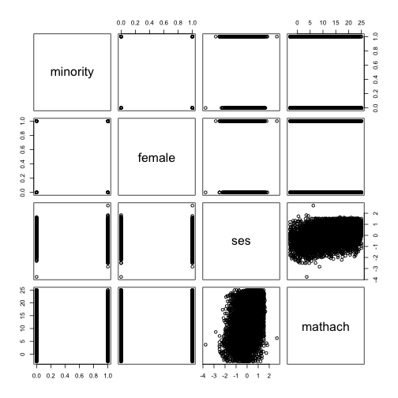
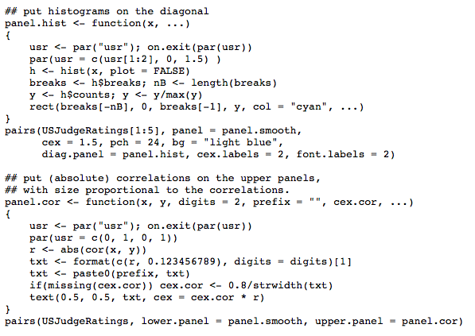
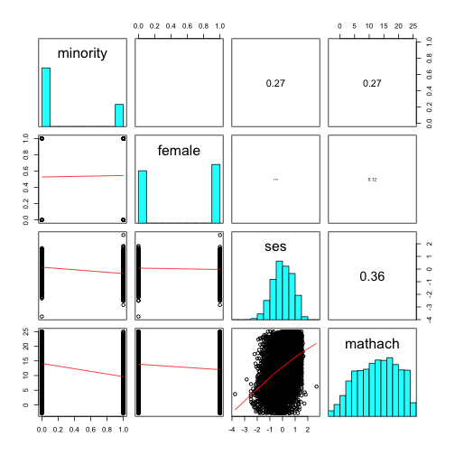
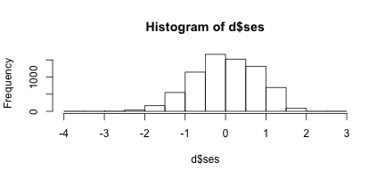
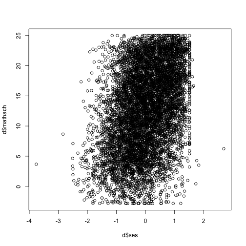
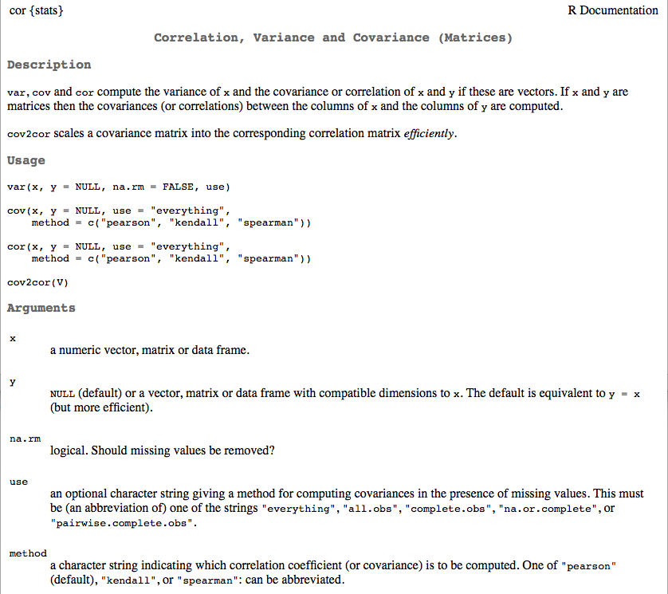
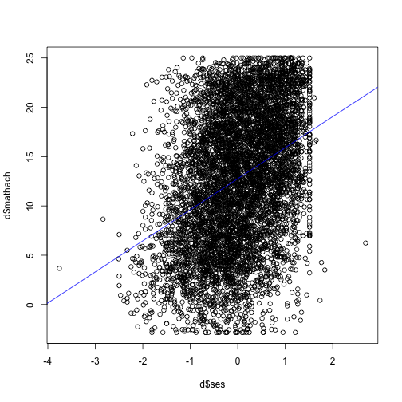

## Agenda
Today is an effort to come up from the weeds a bit and walk through an applied
  example. Specifically we will
* Go through a complete (basic) example
  + process, plot, analyze, plot
* Look at correlations
* Explore linear regression modeling (very cursory)

# Readings
Gelman and Hill, Chapter 3

----
## Load Data
High School and Beyond


```r
library(foreign)
d <- read.spss("./data/HSB.sav", to.data.frame = TRUE)
```

```
## Warning in read.spss("./data/HSB.sav", to.data.frame = TRUE): ./data/
## HSB.sav: Unrecognized record type 7, subtype 18 encountered in system file
```

```
## re-encoding from latin1
```

```r
head(d)
```

```
##     id minority female    ses mathach
## 1 1224        0      1 -1.528   5.876
## 2 1224        0      1 -0.588  19.708
## 3 1224        0      0 -0.528  20.349
## 4 1224        0      0 -0.668   8.781
## 5 1224        0      0 -0.158  17.898
## 6 1224        0      0  0.022   4.583
```

----
## About the HSB data

<span style="color:gray" > 
Our data file is a subsample from the 1982 High School and Beyond Survey and is 
  used extensively in Hierarchical Linear Models by Raudenbush and Bryk. The 
  data file, called hsb, consists of 7185 students nested in 160 schools. The 
  outcome variable of interest is the student-level (level 1) math achievement 
  score (mathach). The variable ses is the socio-economic status of a student 
  and therefore is at the student level. The variable meanses is the group-mean 
  centered version of ses and therefore is at the school level (level 2). The 
  variable sector is an indicator variable indicating if a school is public or 
  catholic and is therefore a school-level variable. There are 90 public schools 
  (sector=0) and 70 catholic schools (sector=1) in the sample.


Description from <br>
http://www.ats.ucla.edu/stat/hlm/seminars/hlm_mlm/608/mlm_hlm_seminar_v608.htm
 </span>


----
## Check out the data a bit


```r
summary(d)
```

```
##        id          minority          female            ses           
##  2305   :  67   Min.   :0.0000   Min.   :0.0000   Min.   :-3.758000  
##  5619   :  66   1st Qu.:0.0000   1st Qu.:0.0000   1st Qu.:-0.538000  
##  4292   :  65   Median :0.0000   Median :1.0000   Median : 0.002000  
##  3610   :  64   Mean   :0.2747   Mean   :0.5282   Mean   : 0.000143  
##  4042   :  64   3rd Qu.:1.0000   3rd Qu.:1.0000   3rd Qu.: 0.602000  
##  8857   :  64   Max.   :1.0000   Max.   :1.0000   Max.   : 2.692000  
##  (Other):6795                                                        
##     mathach      
##  Min.   :-2.832  
##  1st Qu.: 7.275  
##  Median :13.131  
##  Mean   :12.748  
##  3rd Qu.:18.317  
##  Max.   :24.993  
## 
```

----
## Evaluate the structure of the data


```r
str(d)
```

```
## 'data.frame':	7185 obs. of  5 variables:
##  $ id      : Factor w/ 160 levels "1224","1288",..: 1 1 1 1 1 1 1 1 1 1 ...
##  $ minority: num  0 0 0 0 0 0 0 0 0 0 ...
##  $ female  : num  1 1 0 0 0 0 1 0 1 0 ...
##  $ ses     : num  -1.528 -0.588 -0.528 -0.668 -0.158 ...
##  $ mathach : num  5.88 19.71 20.35 8.78 17.9 ...
##  - attr(*, "variable.labels")= Named chr 
##   ..- attr(*, "names")= chr 
##  - attr(*, "codepage")= int 28591
```

----
## What is this ses variable?
"a standardized scale constructed from variables measuring parental education,
occupation, and income" (http://www.upa.pdx.edu/IOA/newsom/mlrclass/ho_hsb.pdf)

<br>
So why doesn't it have a sd of 1?


```r
sd(d$ses)
```

```
## [1] 0.7793552
```

Our dataset is a sample from the full dataset. So you can still interpret a 1
  unit change in the `ses` variable as a one standard deviation increase in the
  population.

----
## Evaluate `id`


```r
table(d$id) # Equivalent to SPSS Frequencies
```

```
## 
## 1224 1288 1296 1308 1317 1358 1374 1433 1436 1461 1462 1477 1499 1637 1906 
##   47   25   48   20   48   30   28   35   44   33   57   62   53   27   53 
## 1909 1942 1946 2030 2208 2277 2305 2336 2458 2467 2526 2626 2629 2639 2651 
##   28   29   39   47   60   61   67   47   57   52   57   38   57   42   38 
## 2655 2658 2755 2768 2771 2818 2917 2990 2995 3013 3020 3039 3088 3152 3332 
##   52   45   47   25   55   42   43   48   46   53   59   21   39   52   38 
## 3351 3377 3427 3498 3499 3533 3610 3657 3688 3705 3716 3838 3881 3967 3992 
##   39   45   49   53   38   48   64   51   43   45   41   54   41   52   53 
## 3999 4042 4173 4223 4253 4292 4325 4350 4383 4410 4420 4458 4511 4523 4530 
##   46   64   44   45   58   65   53   33   25   41   32   48   58   47   63 
## 4642 4868 4931 5192 5404 5619 5640 5650 5667 5720 5761 5762 5783 5815 5819 
##   61   34   58   28   57   66   57   45   61   53   52   37   29   25   50 
## 5838 5937 6074 6089 6144 6170 6291 6366 6397 6415 6443 6464 6469 6484 6578 
##   31   29   56   33   43   21   35   58   60   54   30   29   57   35   56 
## 6600 6808 6816 6897 6990 7011 7101 7172 7232 7276 7332 7341 7342 7345 7364 
##   56   44   55   49   53   33   28   44   52   53   48   51   58   56   44 
## 7635 7688 7697 7734 7890 7919 8009 8150 8165 8175 8188 8193 8202 8357 8367 
##   51   54   32   22   51   37   47   44   49   33   30   43   35   27   14 
## 8477 8531 8627 8628 8707 8775 8800 8854 8857 8874 8946 8983 9021 9104 9158 
##   37   41   53   61   48   48   32   32   64   36   58   51   56   55   53 
## 9198 9225 9292 9340 9347 9359 9397 9508 9550 9586 
##   31   36   19   29   57   53   47   35   29   59
```

---- &twocol
## Create new Student ID
*** =left
# Method 1
Use the rownames


```r
d$SID <- rownames(d)
head(d)
```

```
##     id minority female    ses mathach SID
## 1 1224        0      1 -1.528   5.876   1
## 2 1224        0      1 -0.588  19.708   2
## 3 1224        0      0 -0.528  20.349   3
## 4 1224        0      0 -0.668   8.781   4
## 5 1224        0      0 -0.158  17.898   5
## 6 1224        0      0  0.022   4.583   6
```
*** =right
# Method 2
Use some other arbitrary index


```r
d$SID <- seq(from = 1e2, 
	length.out = nrow(d), by = 8)
head(d)
```

```
##     id minority female    ses mathach SID
## 1 1224        0      1 -1.528   5.876 100
## 2 1224        0      1 -0.588  19.708 108
## 3 1224        0      0 -0.528  20.349 116
## 4 1224        0      0 -0.668   8.781 124
## 5 1224        0      0 -0.158  17.898 132
## 6 1224        0      0  0.022   4.583 140
```

----
## Rename `id` variable to `ScID`


```r
names(d)
```

```
## [1] "id"       "minority" "female"   "ses"      "mathach"  "SID"
```

```r
names(d)[1] <- "ScID"
head(d)
```

```
##   ScID minority female    ses mathach SID
## 1 1224        0      1 -1.528   5.876 100
## 2 1224        0      1 -0.588  19.708 108
## 3 1224        0      0 -0.528  20.349 116
## 4 1224        0      0 -0.668   8.781 124
## 5 1224        0      0 -0.158  17.898 132
## 6 1224        0      0  0.022   4.583 140
```

----
## Reorder variables (house cleaning)


```r
d <- d[ ,c("SID", "ScID", "minority", "female", "ses", "mathach")]
head(d)
```

```
##   SID ScID minority female    ses mathach
## 1 100 1224        0      1 -1.528   5.876
## 2 108 1224        0      1 -0.588  19.708
## 3 116 1224        0      0 -0.528  20.349
## 4 124 1224        0      0 -0.668   8.781
## 5 132 1224        0      0 -0.158  17.898
## 6 140 1224        0      0  0.022   4.583
```
Alternatively, by index


```r
d <- d[ ,c(ncol(d), 1:(ncol(d) - 1))]
```

```r
c(ncol(d), 1:(ncol(d) - 1))
```

```
## [1] 6 1 2 3 4 5
```

----
## Visualize relation among all variables


```r
pairs(d[ ,-c(1:2)])
```

 

----
## Get a better pairs plot
Look at the documentation for `pairs()` (then scroll down)


```r
?pairs
```


---- 
## Fancy pairs plot

# Run the functions from the documentation file


```r
panel.hist <- function(x, ...) {
    usr <- par("usr"); on.exit(par(usr))
    par(usr = c(usr[1:2], 0, 1.5) )
    h <- hist(x, plot = FALSE)
    breaks <- h$breaks; nB <- length(breaks)
    y <- h$counts; y <- y/max(y)
    rect(breaks[-nB], 0, breaks[-1], y, col = "cyan", ...)
}

panel.cor <- function(x, y, digits = 2, prefix = "", cex.cor, ...) {
    usr <- par("usr"); on.exit(par(usr))
    par(usr = c(0, 1, 0, 1))
    r <- abs(cor(x, y))
    txt <- format(c(r, 0.123456789), digits = digits)[1]
    txt <- paste0(prefix, txt)
    if(missing(cex.cor)) cex.cor <- 0.8/strwidth(txt)
    text(0.5, 0.5, txt, cex = cex.cor * r)
}
```

----


```r
pairs(d[ ,-c(1:2)], 
	lower.panel = panel.smooth, 
	diag.panel = panel.hist, 
	upper.panel = panel.cor)
```

 

---- .segue

# Exploring the relation between SES and Math Achievement


---- &twocol
## Individual Plots

*** =left


```r
hist(d$mathach)
```

 

```r
hist(d$ses)
```

 

*** =right


```r
plot(d$ses, d$mathach)
```

 

---- &twocol
## Correlation

*** =left

Use the `cor()` function


```r
cor(d$ses, d$mathach)
```

```
## [1] 0.3607556
```
<br>
And, as always, take a look at the documentation for `cor()`

*** =right


---- &twocol
## Missing data
For illustration purposes, lets randomly make some cases missing, and then try
  to estimate the relation between the variables again

*** =left
# Randomly 10% of assign cases to missing


```r
rand <- rbinom(length(d$ses), 1, .1)
head(rand)
```

```
## [1] 0 0 0 0 0 1
```

```r
head(rand == 1)
```

```
## [1] FALSE FALSE FALSE FALSE FALSE  TRUE
```

```r
d$ses[rand == 1] <- NA
```
*** =right


```r
head(d)
```

```
##   SID ScID minority female    ses mathach
## 1 100 1224        0      1 -1.528   5.876
## 2 108 1224        0      1 -0.588  19.708
## 3 116 1224        0      0 -0.528  20.349
## 4 124 1224        0      0 -0.668   8.781
## 5 132 1224        0      0 -0.158  17.898
## 6 140 1224        0      0     NA   4.583
```

---- &twocol
## Correlation

*** =left


```r
cor(d$ses, d$mathach)
```

```
## [1] NA
```
This fails, because R doesn't know what to do with the missing data. Exclude
  those cases, and let's try again.


```r
temp <- na.omit(d)
head(temp)
```

```
##   SID ScID minority female    ses mathach
## 1 100 1224        0      1 -1.528   5.876
## 2 108 1224        0      1 -0.588  19.708
## 3 116 1224        0      0 -0.528  20.349
## 4 124 1224        0      0 -0.668   8.781
## 5 132 1224        0      0 -0.158  17.898
## 7 148 1224        0      1 -0.618  -2.832
```

*** =right


```r
cor(temp$ses, temp$mathach)
```

```
## [1] 0.3602142
```
Alternatively, use the optional `use` argument


```r
cor(d$ses, d$mathach, 
	use = "complete.obs")
```

```
## [1] 0.3602142
```

----
## Linear regression


```r
?lm
```


----
## Formula structure


```r
lm(outcome ~ predictor1 + predictor2 + predictorN)
```

```
## Error in eval(expr, envir, enclos): object 'outcome' not found
```
# Important additional arguments
* `data`: What data frame do the vectors come from?
* `subset`: Do you want to analyze only a subset of cases?
* `na.action`: How should missing values be handled?

----
## Modeling the relation between SES and Math


```r
m1 <- lm(mathach ~ ses, data = d)
summary(m1)
```


----
## Alternative summary
The `arm` package (applied regression modeling) provides a lot of useful 
  functions. One simple one is just a different method for showing the summary 
  of a regression model, using the `display()` function.


```r
install.packages("arm")
library(arm)
display(m1, detail = TRUE)
```


```
## lm(formula = mathach ~ ses, data = d)
##             coef.est coef.se t value Pr(>|t|)
## (Intercept)  12.73     0.08  159.60    0.00  
## ses           3.17     0.10   30.99    0.00  
## ---
## n = 6443, k = 2
## residual sd = 6.40, R-Squared = 0.13
```
* Note that significance is not printed by default. Use `detail = TRUE` to get 
  significance test.

---- &twocol
## Plot the relation and the model
* Two step process: First plot the relation, then overlay the regression line.

*** =left


```r
# Plot the relation
plot(d$ses, d$mathach)

# Overlay the regression line
abline(a = 12.76, b = 3.15, col = "blue")
```

*** =right

 
