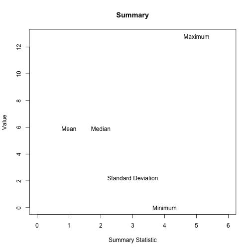
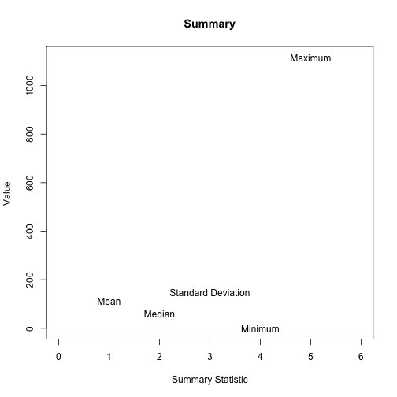
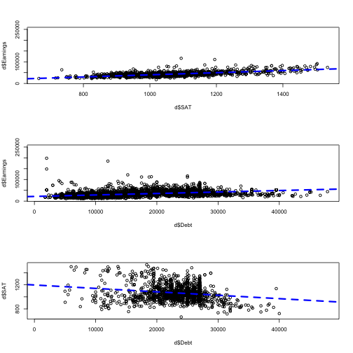
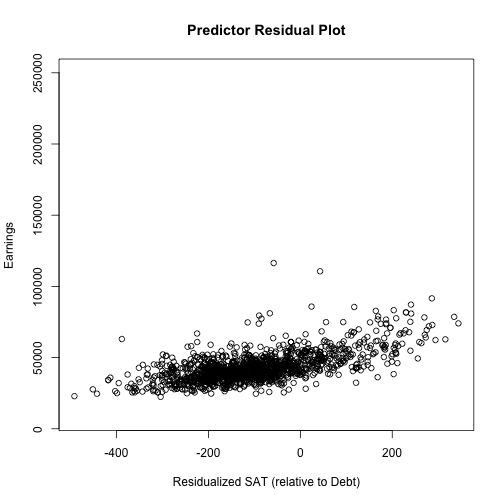
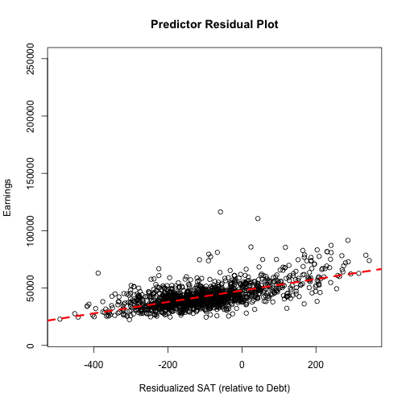
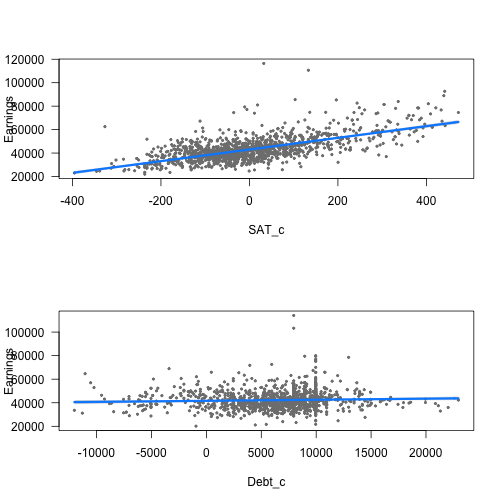
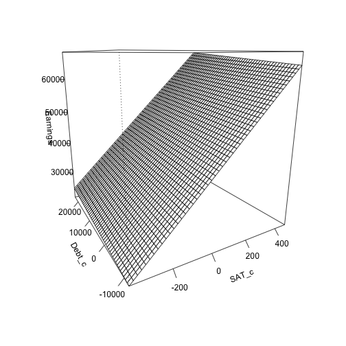
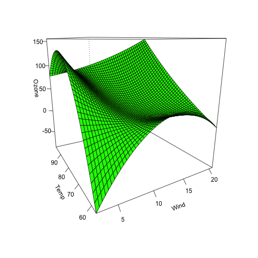

---
title       : Homework 2 Review
subtitle    : 
author      : Daniel Anderson
job         : CourseR
framework   : io2012        # {io2012, html5slides, shower, dzslides, ...}
highlighter : highlight.js  # {highlight.js, prettify, highlight}
hitheme     : zenburn      # 
widgets     : [mathjax]            # {mathjax, quiz, bootstrap}
mode        : selfcontained # {standalone, draft}
knit        : slidify::knit2slides
--- &twocol

## 1. Load data


```r
setwd("/Users/Daniel/Dropbox/Teaching/CourseR/data/")
d <- read.csv("CollegeScorecard.csv", na = c("NULL", "PrivacySuppressed"))
```

Note the use of the `na` vector, rather than an individual argument

---- 
## 2. Process data


# Select appropriate columns and rename variables

```r
d <- d[ ,c("INSTNM", "STABBR", "SAT_AVG_ALL", "GRAD_DEBT_MDN_SUPP", "md_earn_wne_p10")]
names(d) <- c("Institution", "State", "SAT", "Debt", "Earnings")
```

<br>

# Create centered variables

```r
d$SAT_c <- d$SAT - mean(d$SAT, na.rm = TRUE)
mean(d$SAT_c, na.rm = TRUE)
```

```
## [1] -9.040443e-15
```

```r
d$Debt_c <- d$Debt - mean(d$Debt, na.rm = TRUE)
mean(d$Debt_c, na.rm = TRUE)
```

```
## [1] -1.710248e-12
```

---- 
## 3. Create plots


```r
d[5:6, ]
```

```
##                 Institution State  SAT  Debt Earnings     SAT_c    Debt_c
## 5  Alabama State University    AL  830 33452    27800 -231.6277 16405.389
## 6 The University of Alabama    AL 1171 24000    42400  109.3723  6953.389
```


```r
pairs(d[ ,3:5])
```

 

---- &twocol

*** =left


```r
par(mfcol = c(3, 1))
hist(d[ ,3]) # SAT
hist(d[ ,4]) # Debt
hist(d[ ,5]) # Earnings
```

 

*** =right


```r
par(mfcol = c(3, 1))
plot(density(d[ ,3], na.rm = TRUE))
plot(density(d[ ,4], na.rm = TRUE))
plot(density(d[ ,5], na.rm = TRUE))
```

 

----

4. Fit preliminary models


```r
library(arm)
mA <- lm(Earnings ~ SAT, data = d)
display(mA, detail = TRUE)
```

```
## lm(formula = Earnings ~ SAT, data = d)
##             coef.est coef.se  t value  Pr(>|t|)
## (Intercept) -9181.28  1667.70    -5.51     0.00
## SAT            49.04     1.56    31.42     0.00
## ---
## n = 1475, k = 2
## residual sd = 7791.29, R-Squared = 0.40
```

----


```r
mB <- lm(Earnings ~ Debt, data = d)
display(mB, detail = TRUE)
```

```
## lm(formula = Earnings ~ Debt, data = d)
##             coef.est coef.se  t value  Pr(>|t|)
## (Intercept) 21624.71   361.12    59.88     0.00
## Debt            0.68     0.02    37.75     0.00
## ---
## n = 5052, k = 2
## residual sd = 11187.05, R-Squared = 0.22
```

```r
mC <- lm(SAT ~ Debt, data = d)
display(mC, detail = TRUE)
```

```
## lm(formula = SAT ~ Debt, data = d)
##             coef.est coef.se t value Pr(>|t|)
## (Intercept) 1197.35    16.95   70.62    0.00 
## Debt          -0.01     0.00   -8.06    0.00 
## ---
## n = 1502, k = 2
## residual sd = 126.70, R-Squared = 0.04
```

----

# 5. Regression model results

* Coefficents represent the expected change in the outcome given a 1 unit
  increase in the predictor. 
* Coefficient for `Debt` is very small, because it represents the expected 
  change in the outcome given a one dollar increase in debt. 
* Intercepts range from difficult to interpret, to impossible. For example, the
  SAT scale does not go below 200, yet the intercept in Model A represents the expected earnings for schools with an average SAT score of 0. After centering the variables and refitting the models (code below), the intercepts represent the expected value of the outcome when the school has an average level of the predictor.

---- &twocol
# Regression plots

*** =left


```r
par(mfcol = c(3,1))

plot(d$Earnings ~ d$SAT)
abline(coef(mA)[1], coef(mA)[2], 
  col = "blue", lwd = 3, lty = 2)

plot(d$Earnings ~ d$Debt)
abline(coef(mB)[1], coef(mB)[2], 
  col = "blue", lwd = 3, lty = 2)

plot(d$SAT ~ d$Debt)
abline(coef(mC)[1], coef(mC)[2], 
  col = "blue", lwd = 3, lty = 2)
```

*** =right

 

----
# Refit models with centered variables


```r
mAc <- lm(Earnings ~ SAT_c, data = d)
display(mAc, detail = TRUE)
```

```
## lm(formula = Earnings ~ SAT_c, data = d)
##             coef.est coef.se  t value  Pr(>|t|)
## (Intercept) 42885.13   202.88   211.39     0.00
## SAT_c          49.04     1.56    31.42     0.00
## ---
## n = 1475, k = 2
## residual sd = 7791.29, R-Squared = 0.40
```

----


```r
mBc <- lm(Earnings ~ Debt_c, data = d)
display(mBc, detail = TRUE)
```

```
## lm(formula = Earnings ~ Debt_c, data = d)
##             coef.est coef.se  t value  Pr(>|t|)
## (Intercept) 33263.84   158.27   210.17     0.00
## Debt_c          0.68     0.02    37.75     0.00
## ---
## n = 5052, k = 2
## residual sd = 11187.05, R-Squared = 0.22
```

```r
mCc <- lm(SAT_c ~ Debt_c, data = d)
display(mCc, detail = TRUE)
```

```
## lm(formula = SAT_c ~ Debt_c, data = d)
##             coef.est coef.se t value Pr(>|t|)
## (Intercept) 38.77     5.65    6.87    0.00   
## Debt_c      -0.01     0.00   -8.06    0.00   
## ---
## n = 1502, k = 2
## residual sd = 126.70, R-Squared = 0.04
```

----

## 6. Fit the multiple regression model


```r
mr <- lm(Earnings ~ SAT_c + Debt_c, data = d)
display(mr, detail = TRUE)
```

```
## lm(formula = Earnings ~ SAT_c + Debt_c, data = d)
##             coef.est coef.se  t value  Pr(>|t|)
## (Intercept) 42308.84   365.64   115.71     0.00
## SAT_c          49.72     1.61    30.86     0.00
## Debt_c          0.09     0.05     1.99     0.05
## ---
## n = 1455, k = 3
## residual sd = 7783.43, R-Squared = 0.40
```

----

## Extra Credit 
# Predictor-residual plot

One of the best ways to visualize multiple regression models is through a
  predictor residual plot, which displays the relation between one of the variables and the outcome after partialing common variance with the other predictor. In the case of a model with two predictors, you would

* Fit a model with one predictor as the `Y` (outcome) and one as the `X` 
  (predictor). For example, Model C.
* Use this model to compute predicted scores for each observation
* Use the predicted scores to compute residuals (i.e., the relation between `X1` 
  partialed from `X2`, or vice-versa)
* Plot the relation between the computed residual and the outcome

----
* Fit a model with one predictor as the `Y` (outcome) and one as the `X` 
  (predictor). For example, Model C.
* Use this model to compute predicted scores for each observation


```r
mCc <- lm(SAT_c ~ Debt_c, data = d)
predSAT <- coef(mCc)[1] + coef(mCc)[2]*d$Debt_c
```

* Use the predicted scores to compute residuals (i.e., the relation between `X1` 
  partialed from `X2`, or vice-versa)


```r
resSAT <- d$SAT_c - predSAT
```

---- &twocol

* Plot the relation between the computed residual and the outcome

*** =left


```r
plot(resSAT, d$Earnings, 
  main = "Predictor Residual Plot", 
  xlab = "Residualized SAT 
    (relative to Debt)",
  ylab = "Earnings")
```

*** =right

 


----

The previous plot displays the relation between `Earnings` and `SAT_c` while
  accounting for (i.e., residualzing for) `Debt_c`. To actually plot the residualzed line, you'll need to fit one additional model.


```r
resLine <- lm(d$Earnings ~ resSAT)
coef(resLine)
```

```
## (Intercept)      resSAT 
##       47806          50
```

<br>

Note that the coefficient for the above model is essentially equivalent to the 
  multiple regression coefficient, and if there were no missing data would be identical (though the intercept does change, because of meaning of a value of 0 on the residualized predictor).


```r
coef(mr)
```

```
## (Intercept)       SAT_c      Debt_c 
##   42308.842      49.719       0.092
```

----

To add the regression line, just use `abline()` like normal

 


```r
abline(coef(resLine)[1], coef(resLine)[2], col = "red", lwd = 3, lty = 2)
```

---- &twocol

## Quick extension: View the other predictor residual plot

*** =left


```r
mDc <- lm(Debt_c ~ SAT_c, data = d)
predDebt <- coef(mDc)[1] + 
            coef(mDc)[2]*d$SAT_c
resDebt <- d$Debt_c - predDebt
resDebtLine <- lm(d$Earnings ~ resDebt)

plot(resSAT, d$Earnings, 
  main = "Predictor Residual Plot", 
  xlab = "Residualized Debt 
    (relative to SAT)",
  ylab = "Earnings")

abline(coef(resDebtLine)[1], 
       coef(resDebtLine)[2], 
  col = "purple", lwd = 3, lty = 2)
```

*** =right

 

---- &twocol
## Final note: Use a package

*** =left


```r
install.packages("visreg")
library(visreg)
par(mfrow = c(2,1))
visreg(mr)
```

*** =right

 

----
## Or a 3d plot


```r
visreg2d(mr, "SAT_c", "Debt_c", plot.type = "persp")
```

 

---- &twocol
# Example with a crazy model

*** =left


```r
fit <- lm(Ozone ~ Solar.R + Wind + 
  Temp + I(Wind^2) + I(Temp^2) + 
  I(Wind * Temp) + I(Wind*Temp^2) + 
  I(Temp*Wind^2) + I(Temp^2 * Wind^2),
  data = airquality)

visreg2d(fit, "Wind", "Temp", 
  plot.type = "persp", col = "green")
```

*** =right

 
